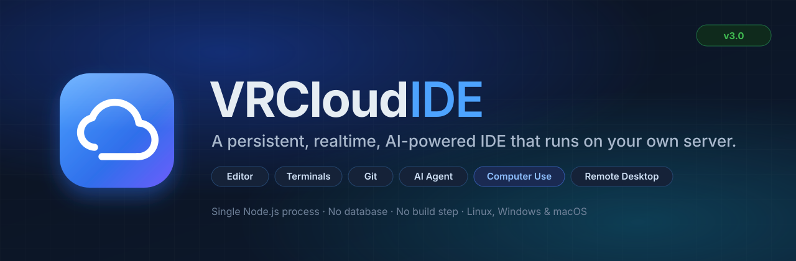
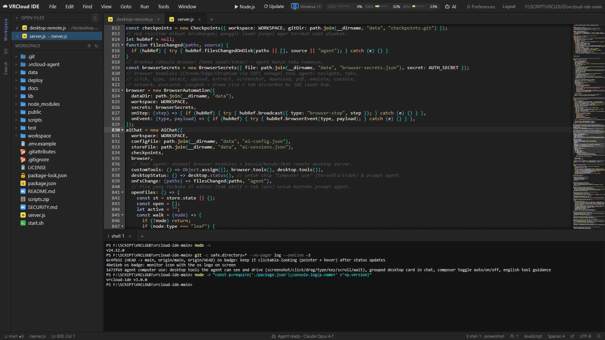
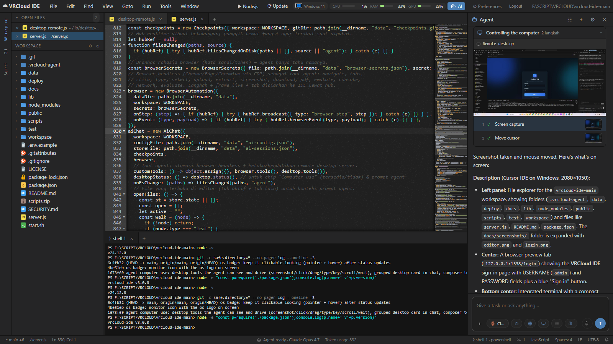
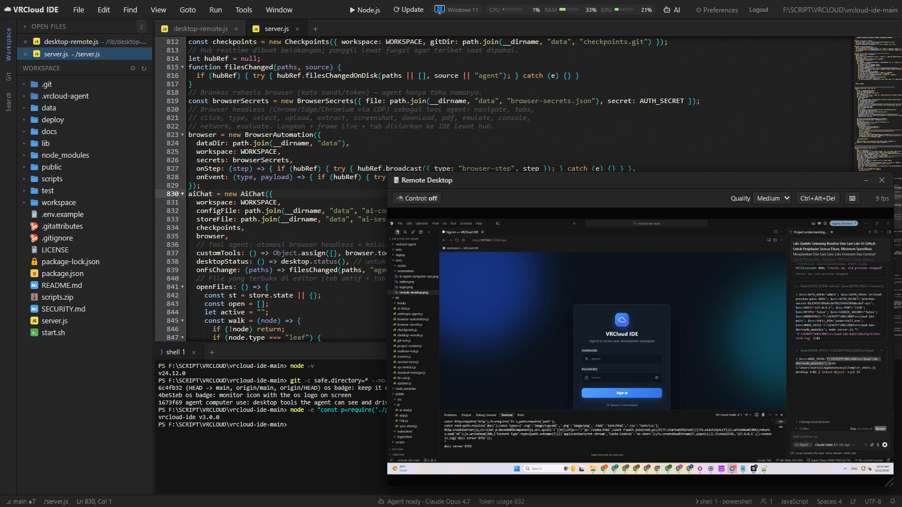
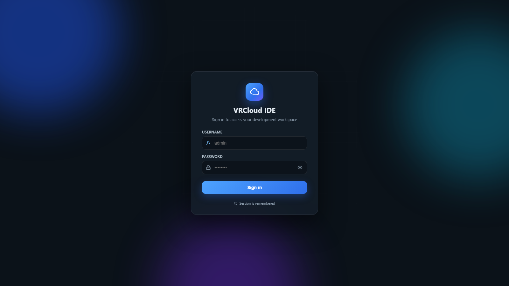

<p align="center">
  <a href="https://github.com/bayar-gg/vrcloud-ide">
    
  </a>
</p>

<p align="center">
  <a href="CHANGELOG.md"></a>
  <a href="LICENSE"></a>
  
  
  
  <a href="https://github.com/bayar-gg/vrcloud-ide/stargazers"></a>
  <a href="https://github.com/bayar-gg/vrcloud-ide/issues"></a>
</p>

<p align="center">
  <b>A persistent, realtime, AI-powered IDE that runs on your own server.</b><br>
  Open it in any browser and get an editor, terminals, a file manager, git, a remote desktop
  and an AI agent that edits files, runs commands, browses the web and operates the desktop for you.
  Close the tab, come back later &mdash; everything is exactly where you left it.
</p>

<p align="center">
  <a href="#quick-start">Quick start</a> &middot;
  <a href="#feature-overview">Features</a> &middot;
  <a href="#the-ide">The IDE</a> &middot;
  <a href="#the-ai-agent">AI agent</a> &middot;
  <a href="#computer-use">Computer use</a> &middot;
  <a href="#remote-desktop">Remote desktop</a> &middot;
  <a href="#requirements">Requirements</a> &middot;
  <a href="#configuration">Configuration</a> &middot;
  <a href="#reference">Reference</a> &middot;
  <a href="#security">Security</a> &middot;
  <a href="#faq">FAQ</a> &middot;
  <a href="#author">Author</a>
</p>

---

## Table of contents

- [Why VRCloud IDE](#why-vrcloud-ide)
- [Preview](#preview)
- [Quick start](#quick-start) &mdash; Linux, Windows, manual
- [Feature overview](#feature-overview)
- [The IDE](#the-ide) &mdash; editor, panes, terminals, Run, files, search, git, realtime, notifications, HTTPS, updates, languages
- [The AI agent](#the-ai-agent) &mdash; providers, tools, composer, context, safety, browser agent, history
- [Computer use](#computer-use)
- [Remote desktop](#remote-desktop)
- [Requirements](#requirements)
- [Configuration](#configuration)
- [Day to day](#day-to-day)
- [Reference](#reference) &mdash; menus, keyboard shortcuts, status bar, preferences, agent settings, project files, REST/WebSocket API
- [Data and backups](#data-and-backups)
- [Security](#security)
- [Project layout](#project-layout)
- [Versioning and updates](#versioning-and-updates)
- [FAQ](#faq) &middot; [Troubleshooting](#troubleshooting)
- [Contributing](#contributing) &middot; [License](#license) &middot; [Author](#author)

## Why VRCloud IDE

VRCloud IDE is what you get when you want Cloud9 back, but on a cheap box you control,
with a modern agent built in. It is a **single Node.js process**: no database, no build
step, no Docker required. Drop it on a VPS (or your Windows workstation), open
`https://your-ip:1337`, log in, and work from any laptop, tablet or phone.

- **Persistent** &mdash; layout, open files, unsaved buffers, terminals and AI conversations
  survive browser restarts and server restarts.
- **Realtime** &mdash; open the same URL in two browsers and they mirror each other: tabs,
  splits, cursors, terminal output, sidebar, AI panel, even the remote desktop window.
- **AI-native** &mdash; an autonomous agent with file, shell, search, web, browser and desktop
  tools, shadow-git checkpoints, per-file review, command approval gates, project memory,
  skills and rules.
- **Computer use** &mdash; the agent can look at the server's screen and click, type and drag
  like a person, with a live "Controlling the computer" card in the chat.
- **Self-hosted** &mdash; your code, your keys, your machine. MIT licensed.

## Preview

<table>
  <tr>
    <td width="50%">
      <a href="docs/screenshots/editor.png"></a>
      <p align="center"><sub><b>Editor + terminals</b> &mdash; Ace editor with split panes, VS Code-style icons, minimap, shared buffers and tmux-backed shells.</sub></p>
    </td>
    <td width="50%">
      <a href="docs/screenshots/ai-agent-computer-use.png"></a>
      <p align="center"><sub><b>AI agent with computer use</b> &mdash; the agent takes a screenshot, describes the screen and moves the mouse; steps fold into one live card.</sub></p>
    </td>
  </tr>
  <tr>
    <td width="50%">
      <a href="docs/screenshots/remote-desktop.png"></a>
      <p align="center"><sub><b>Remote desktop</b> &mdash; stream and control the server's desktop from the OS badge; one click installs a virtual desktop on headless Linux.</sub></p>
    </td>
    <td width="50%">
      <a href="docs/screenshots/login.png"></a>
      <p align="center"><sub><b>Login</b> &mdash; single-user authentication with HTTPS out of the box, brute-force lockout and remembered sessions.</sub></p>
    </td>
  </tr>
</table>

## Quick start

### Linux (Ubuntu / Debian VPS)

Run as root on a fresh server:

```bash
curl -fsSL https://raw.githubusercontent.com/bayar-gg/vrcloud-ide/main/scripts/bootstrap.sh | sudo bash
```

The installer sets up Node.js 22, tmux and git, clones the app into `/opt/vrcloud-ide`,
generates a random password, creates a systemd service and installs the `vrcloud` CLI.

```bash
vrcloud start          # start the service and wait until it is ready
vrcloud password       # show the login (also printed by the installer)
```

Open `https://YOUR_IP:1337/`. The certificate is self-signed, so the browser asks once;
accept it and log in.

Custom port or workspace:

```bash
curl -fsSL https://raw.githubusercontent.com/bayar-gg/vrcloud-ide/main/scripts/bootstrap.sh \
  | sudo env PORT=8080 WORKSPACE=/srv/code bash
```

By default the service runs as **root** so that `apt`, `sudo`, Docker and friends work
inside the browser terminal. For a locked-down install use `VRCLOUD_ROOT_ACCESS=false`
and the service runs as a dedicated `vrcloud` user. Either way, put it behind a firewall
or VPN if the server is reachable from the internet &mdash; whoever logs in owns the box.

### Windows 10 / 11

```powershell
git clone https://github.com/bayar-gg/vrcloud-ide.git
cd vrcloud-ide
powershell -ExecutionPolicy Bypass -File scripts\install-windows.ps1
```

This installs dependencies, writes `.env`, registers a Scheduled Task that starts the IDE
at logon, opens the Windows Firewall port, and prints `https://YOUR_IP:1337/` (public IP,
LAN address, and localhost) the same way the Linux installer does. The certificate is
self-signed, so the browser asks once. Manage it with:

```powershell
powershell -File scripts\vrcloud.ps1 start | stop | restart | status | update | logs | password | newpassword
```

Terminals use ConPTY (PowerShell by default), the Run button uses whatever toolchains are
installed, and Remote Desktop / computer use stream the interactive user session.

### Manual (any OS, including macOS)

```bash
git clone https://github.com/bayar-gg/vrcloud-ide.git
cd vrcloud-ide
npm ci --omit=dev
cp .env.example .env      # set AUTH_USER, AUTH_PASS and a 32+ character AUTH_SECRET
npm start
```

Requires Node.js 22.13 or newer. On Linux, `tmux` is optional but recommended: without it,
terminals do not survive a server restart.

## Feature overview

| Area | What you get |
| --- | --- |
| Editor | Ace editor, 100+ languages, minimap, multi-cursor, find/replace, indentation and EOL control, syntax override, font size, wrap, per-file language detection |
| Panes | Unlimited splits by dragging tabs to edges, drag dividers, split-to-4, terminal splits in any direction, floating panels that dock as tabs |
| Realtime | Shared documents with ~40 ms sync, cursors of other browsers, mirrored layout / tabs / terminals / sidebar / AI panel / remote desktop, presence counter |
| Terminals | tmux (Linux) or ConPTY (Windows) shells, survive restarts, terminal tabs in any pane, copy/paste, "new terminal here", agent shell mirror |
| Run | Detects the interpreter/compiler for ~60 extensions on the server, runs in the file's folder in a floating terminal, live label, runner list and re-detect |
| Files | Tree with VS Code-style icons, inline new file/folder/rename, drag-and-drop upload (500 MB), download, copy/paste/duplicate, zip/unzip, favorites, Open Files list, project download |
| Search | Workspace search with regex, case, whole word, include/exclude globs, per-hit and per-file replace |
| Git | Status, stage/unstage, discard, commit, branch switch/create, init, log; branch and dirty count in the status bar |
| AI agent | Cursor SDK or Anthropic Claude; plans with todos; file/shell/search/web tools; browser automation; computer use; checkpoints; per-file review; approvals; skills, rules, memory; queue; attachments; voice; history export/import |
| Computer use | Screenshot, click, drag, move, type, key, scroll, wait, setup &mdash; grouped "Controlling the computer" card; Auto / On / Off chip |
| Remote desktop | VNC-like streaming and control of the server desktop on Windows, Linux, macOS; one-click virtual desktop on headless Linux; mirrored across browsers |
| Notifications | Bell with unread badge and history, toasts, optional browser notifications |
| Platform | HTTPS with auto certificate, single-user login with lockout, self-update from the menubar, system metrics (CPU / RAM / GPU), English and Indonesian UI |

## The IDE

### Editor

- **Ace editor** with syntax highlighting for 100+ languages, minimap (click or drag to
  scroll), bracket matching, multi-cursor, find and replace (`Ctrl+F`,
  `Ctrl+H`), to upper/lower case, undo/redo history per file.
- **Language, indentation and line endings** are detected per file and shown in the status
  bar; click them to override the syntax mode, switch between tabs and spaces (2/4/8), detect
  indentation from the file, or convert LF / CRLF on the next save.
- **View options**: toggle Open Files, tab buttons, gutter, minimap and status bar; font size
  up/down/reset; wrap lines or wrap to print margin. Settings persist per browser.
- **Shared buffers** &mdash; every open file is a single document on the server. Two browsers
  see each other's cursors and edits with ~40 ms latency; the server resolves conflicts and
  retries local edits so nothing you type is lost.
- **Live disk sync** &mdash; edits are written as you type; if the file changes on disk (the
  agent, a build script, `git checkout`) the open tab updates in place, and dirty tabs are
  never overwritten without your input.
- **Go to line** (`Ctrl+G`), **fuzzy file finder** (`Ctrl+P`), **go to file by path**,
  **command palette** (`Ctrl+Shift+P`) listing every menu action and AI command.

### Panes, tabs and layout

- Drag a tab onto another pane to move it, onto a pane edge to split vertically or
  horizontally, or onto the screen edge to create a new column/row. Drag the dividers to
  resize; click the `+` in a pane's tab bar to add a terminal there.
- **Window** menu: new terminal (`F6`), new terminal in the selected folder (`Alt+L`),
  split active pane to 4, add a terminal to the right / left / below / above.
- **Floating panels** (Run output, Update log, Remote Desktop) can be dragged, resized,
  minimized and docked as a tab in any pane.
- The whole layout, the active tab in each pane and the Open Files list are part of the
  shared session, so a second browser shows the same arrangement.

### Terminals

- Real shells over WebSocket: bash (or `SHELL_BIN`) on Linux/macOS, PowerShell on Windows.
- On Linux every terminal lives in **tmux**, so a dropped connection or `vrcloud restart`
  does not kill your processes and reconnecting shows the scrollback.
- Multiple terminals per pane, terminal tabs in any split, output mirrored to all browsers.
- `Ctrl+C` copies when text is selected and interrupts otherwise; `Ctrl+V` and right-click
  paste; context menu with copy / paste / select all / clear.
- **Agent shell** tab: a read-only mirror of the commands the AI agent runs, and a
  "background terminals" indicator above the composer for dev servers and watchers the agent
  left running.
- **Dev server preview**: when a command prints a local URL (`localhost:3000`, `:8080`, ...),
  a pill appears offering to open it in the built-in browser tab.

### Run button

The **Run** button in the menubar shows the toolchain that will run the active file &mdash;
detected on the server for the file's extension (Python, Node.js, TypeScript, Go, Rust,
Java, Kotlin, C, C++, C#, PHP, Ruby, Perl, Lua, Dart, Swift, R, Julia, Elixir, Haskell, OCaml,
Zig, Nim, Crystal, Bash, PowerShell, and about 60 extensions in total). It saves, then runs the
file in **its own folder** in a floating terminal you can drag, minimize or dock. The
**Run** menu lists the available runners and can re-detect them after you install a compiler.

### Files

- Tree with **VS Code-style icons**, lazy loading, keyboard navigation, multi-select.
- Inline **new file / new folder / rename** (`F2`) with validation, `Delete` with
  confirmation, copy / cut / paste, duplicate, copy path, open terminal here, search here.
- **Upload** by drag-and-drop or from the File menu (up to 500 MB per request), **download**
  any file or folder (folders as zip), **download the whole project**, **zip / unzip** in
  place.
- **Favorites** list for files and folders, **Open Files** list with a collapsible header,
  git status badges on changed files.

### Search

`Ctrl+Shift+F` opens workspace search: regex, match case, whole word, include and exclude
globs, results grouped by file with context, click to jump, **replace** per hit, per file or
everywhere. Results are cached and dismissable.

### Source control

The **Git** sidebar shows staged, unstaged and untracked files with diffs; stage, unstage
and discard per file or all; commit with a message; switch or create branches; view the log;
initialise a repository. The status bar shows the current branch and dirty count. The AI
agent's checkpoints use a separate shadow repository, so your real git history stays clean.

### Realtime, multi-browser

Everything about the session is shared, not just files: the split layout, which tabs are open
and active, cursor positions, terminal output, the active sidebar view, whether the AI panel
is open, and the Remote Desktop window. A presence counter in the status bar shows how many
browsers are connected. Use it from a desktop and a phone at the same time, or for pairing on
one workspace.

### Notifications

A bell in the status bar collects agent and system notifications with an unread badge and a
history dropdown. Toasts appear in the IDE; optionally, browser notifications fire when the
agent finishes a task while the tab is in the background (opt-in in agent settings).

### HTTPS, login and sessions

- HTTPS on by default with an automatically generated self-signed certificate whose SANs
  cover `localhost`, the server's private IPs and its public IP, so `https://IP:PORT` works
  immediately. Bring your own certificate with `TLS_CERT` / `TLS_KEY`, or add names with
  `TLS_SAN`.
- Single-user login with a signed session cookie, configurable lifetime (7 days by default),
  remembered sessions, and a 5-minute lockout after repeated failed attempts.
- Log out from the menubar; `vrcloud newpassword` rotates the password and invalidates all
  sessions.

### System metrics and self-update

- The menubar shows the server OS badge (monitor icon with the OS logo &mdash; click for
  Remote Desktop) and live **CPU / RAM / GPU** gauges.
- **Update** in the menubar turns green when a new version is available. Click it (or run
  `vrcloud update`) to fetch the current version while the server keeps running, reinstall
  dependencies only when the lockfile changed, and restart at the end &mdash; with a live log
  panel. The Tools menu can also check for updates on demand.

### Languages

The UI ships in **English** and **Indonesian**; switch it under Preferences. Dynamic content
(tool cards, option chips, dialogs, the Remote Desktop panel) and the login page follow the
same setting. Everything the agent reads is English regardless of the UI language.

## The AI agent

The panel on the right (`Alt+A`) is an autonomous coding agent. Give it a task; it breaks it
into a todo list, reads and edits files, runs commands, searches the web, drives a headless
browser and, when needed, operates the desktop &mdash; and keeps going until the task actually
works, verifying with tests, builds or screenshots before it reports back.

### Providers and models

| Provider | Key | What you get |
| --- | --- | --- |
| **Cursor SDK** | `CURSOR_API_KEY` | Cursor's models (including Auto) and native tools through `@cursor/sdk`. Project rules, skills and hooks are loaded from `.vrcloud-agent/`. |
| **Anthropic** | `ANTHROPIC_API_KEY` | Talks to Claude directly (Sonnet / Opus 4.x) with a tool set implemented in this repository. Extended thinking, effort level, 1M context and prompt caching are toggled from the model menu. |

Keys can be set in `.env` or entered in the agent settings panel (stored in
`data/ai-config.json`). If both are present, pick the provider in the panel. The model chip
in the composer shows the current model and its parameters (thinking, effort, context) and
opens a searchable model list with per-provider logos.

### Tools

**Workspace and system**

| Tool | Purpose |
| --- | --- |
| `read`, `ls`, `glob`, `grep` | Understand the code: read with offsets, list, find files, search with context |
| `edit`, `write`, `delete` | Precise text replacement, new files or full rewrites, deletion |
| `shell` | Non-interactive commands in the workspace, foreground or `background` for servers and watchers; output is mirrored to the Agent shell tab |
| `updateTodos` | Maintain the visible plan; statuses update as the agent works |
| `WebFetch` | Read URLs and documentation as text |

**Browser automation** (`browser_*`, Chrome / Edge / Chromium / Brave via CDP)

`navigate`, `tabs`, `snapshot` (accessibility tree with refs), `extract` (markdown / text /
table / links), `click`, `hover`, `type`, `select`, `upload`, `drag`, `press_key`, `scroll`,
`screenshot`, `console`, `network`, `evaluate`, `wait`, `request_user` (hand a CAPTCHA or
login to you), `secrets` (fill saved credentials without exposing them to the model),
`emulate` (device, locale, timezone, colour scheme, offline), `download`, `pdf`, `back`,
`close`. Tracker blocking is on by default. Every step is recorded with a screenshot and shown
in a **"Browsing the web"** card; a whole session can be exported as a **Playwright** test.

**Computer use** (`desktop_*`) &mdash; see [Computer use](#computer-use).

### Working with the agent

- **Composer**: multi-line input (`Enter` sends, `Shift+Enter` newline), **voice dictation**,
  and image / file attachments (paste an image or use the `+` menu).
- **`+` menu**: attach the editor selection (`Ctrl+L`), the active file, the last 200 lines
  of the active terminal, or images / files from your computer.
- **`@file`** mentions with fuzzy search; **`/skill`** to pick a reusable skill.
- **Quick actions** on a selection in the editor (right-click): explain this code, fix problems,
  write tests, refactor, add documentation &mdash; each attaches the selection and sends a
  ready-made prompt.
- **Queue**: while the agent is busy, new messages are queued and sent automatically when it
  finishes; queued items can be cancelled.
- **Modes**: **Agent** (plan and execute), **Plan** (plan only, one round), **Ask**
  (read-only: no edits, no shell).
- **Chips**: Browser tools Auto / On / Off, Computer use Auto / On / Off, Review on / off,
  Skills picker, model settings.
- **Streaming UI** like Claude and ChatGPT: live thinking blocks with duration, todo plan card,
  tool cards that expand to show diffs or command output, grouped read/browse/desktop steps,
  GFM tables, nested and task lists, code blocks with copy, copy-message action, per-turn
  token usage in the status bar.
- **Stop** at any time; **reset** the conversation; the composer stays usable while the agent
  runs.

### Context the agent gets automatically

- A **project snapshot**: detected stack and scripts, git branch and status, top-level tree
  and recently changed files (cached and rate-limited).
- The **files open in your editor** and the active file, so "fix this" needs no path.
- `AGENTS.md` at the workspace root.
- **Rules** in `.vrcloud-agent/rules/*.md` (optionally scoped by globs, optionally auto-applied).
- **Skills** in `.vrcloud-agent/skills/<name>/SKILL.md` &mdash; reusable procedures picked with
  `/` or used automatically when relevant. Skills and rules have a built-in editor in the
  panel (create, edit, delete) and the agent can create new ones on request.
- **Project memory** in `.vrcloud-agent/memory.md`: durable facts the agent learns across
  conversations (conventions, correct build commands, pitfalls). Editable, and can be turned
  off in settings.
- For the Cursor provider, `.vrcloud-agent` is exposed as `.cursor` so Cursor-format rules,
  skills and hooks load natively.

### Safety and review

- **Checkpoints**: a shadow-git snapshot of the workspace is taken before every run. Each
  message has a restore button (whole workspace or a single file).
- **Review mode**: a review card lists every changed file with a diff; accept or reject per
  file or all at once, and click a file to jump to the first changed line. With review off,
  changes apply directly but remain restorable.
- **Command approval**: commands matching configurable regex patterns (`rm -rf`,
  `git push --force`, `drop table`, `mkfs`, ... by default) pause for your approval with a
  timeout; a shell guard hook enforces the same for the Cursor provider.
- **Verify command**: an optional command (tests, lint, build) the agent runs after changing
  code.
- **Failure detection**: identical tool failures are counted and the agent is told to change
  approach instead of looping; long histories are compacted; shell output is truncated.
- **Ask mode** for read-only sessions; **Off** on the Browser and Computer chips unregisters
  those tools entirely.

### Browser agent tab

A **Browser agent** tab shows the headless browser live while the agent works, with the
agent's tabs listed. **Take over** to click and type yourself (for logins, CAPTCHAs or manual
checks) and hand control back. Your own tabs are separate from the agent's. The **secrets
vault** (encrypted with `AUTH_SECRET`) stores credentials the agent can fill without ever
seeing them. If no browser is installed, Preferences &rarr; Server downloads **Chrome for
Testing** in one click.

### Conversation history

Conversations are stored on the server. The history panel lists them with titles, lets you
rename, delete, **export as Markdown** and **import** conversations, and switch between them.
The active conversation, its draft and its running state are mirrored to other browsers.

## Computer use

Computer use lets the agent operate the server's desktop the way a person would &mdash; the
same idea as OpenAI Operator, Anthropic Computer Use or Grok's desktop control, but running
on **your** machine against **your** screen.

| Tool | What it does |
| --- | --- |
| `desktop_screenshot` | Returns the screen as an image (`detail: "high"` for small text). |
| `desktop_click` | Left / right / middle click, optional double-click, at fractional coordinates. |
| `desktop_drag` | Press, move and release &mdash; drag and drop, window moves, selections. |
| `desktop_move` | Hover without clicking. |
| `desktop_type` | Type text into the focused field. |
| `desktop_key` | Key combinations using `KeyboardEvent.code` (e.g. `ControlLeft+KeyC`), with repeat. |
| `desktop_scroll` | Wheel scrolling in any direction, over a given point. |
| `desktop_wait` | Let the UI settle, then screenshot. |
| `desktop_setup` | Headless Linux: install a virtual desktop (Xvfb + XFCE + xdotool). |

Coordinates are fractions of the screen (0..1), so they are independent of resolution.
Every action returns a fresh screenshot, which the agent reads before deciding the next
step. In the chat, consecutive desktop actions fold into a single **"Controlling the
computer"** card with a large live frame and numbered steps with thumbnails.

The agent's guidance covers the full playbook: screenshot first, prefer keyboard shortcuts
and typed paths over hunting for buttons, prefer shell tools when a command can do the job,
wait instead of re-clicking when nothing changed, and verify the final state visually.
Login, sign-up, forms, CAPTCHA, checkout, and payment are completed as part of the task
instead of being handed back.

Toggle it with the **Computer** chip in the composer: **Auto** (agent decides), **On**
(prefer the GUI for app and window tasks), **Off** (tools are not registered at all).

## Remote desktop

Click the OS badge in the menubar (the monitor icon with your OS logo) to open a floating
**Remote Desktop** window that streams the server's screen as JPEG frames over WebSocket and
lets you take mouse and keyboard control, send `Ctrl+Alt+Del`, adjust quality (low / medium /
high) and watch the frame rate. The panel can be resized, minimized and docked, and it is
mirrored to other connected browsers.

| Platform | Capture | Input | Notes |
| --- | --- | --- | --- |
| Windows 10/11 | GDI via a small PowerShell helper | `user32` mouse/keyboard events | Streams the interactive user session (Scheduled Task at logon). AMSI-safe helpers. |
| Linux (X11) | ImageMagick `import`, `scrot` or `ffmpeg` | `xdotool` | Existing `DISPLAY`, or a virtual desktop installed by **desktop_setup** / the "Install virtual desktop" button. |
| macOS | `screencapture` | `cliclick` / AppleScript | Grant Screen Recording and Accessibility permissions to the Node.js process. |

On a headless Linux VPS, the panel offers a one-click **Install virtual desktop** button that
runs `scripts/desktop-setup.sh` (Xvfb + XFCE + xdotool + ImageMagick) and starts a display
the agent and the panel can use.

## Requirements

### Server

| | Minimum | Recommended |
| --- | --- | --- |
| CPU | 1 vCPU | 2 vCPU (4 if the agent uses the headless browser a lot) |
| RAM | 1 GB | 2 GB; 4 GB with browser automation or a virtual desktop |
| Disk | 500 MB for the app and dependencies + your workspace | SSD |
| Node.js | 22.13 | current 22.x LTS |
| OS | Ubuntu 20.04+, Debian 11+, Windows 10/11, macOS 12+ | Ubuntu 22.04 / 24.04 LTS |
| Network | one open TCP port (default 1337), WebSocket pass-through if proxied | |

Optional server packages:

- `tmux` (Linux) &mdash; persistent terminals across restarts.
- `git` &mdash; source control panel, AI checkpoints and self-update.
- Chrome, Edge, Chromium or Brave &mdash; browser automation for the agent (auto-detected; can also
  be downloaded from Preferences &rarr; Server as "Chrome for Testing").
- Linux desktop stack for remote desktop / computer use: an X display or Xvfb + XFCE, `xdotool`,
  ImageMagick (installed by `desktop_setup`).
- Interpreters and compilers you want the Run button to use (python3, node, go, gcc, ...).

### Client

Any modern browser (Chrome, Edge, Firefox, Safari) with WebSocket support. Works on tablets and
phones; a keyboard is recommended for the editor.

## Configuration

All configuration lives in `.env` next to `server.js`. Keep it `chmod 600`.

| Variable | Default | Description |
| --- | --- | --- |
| `PORT` | `1337` | HTTP/HTTPS port. |
| `HOST` | `0.0.0.0` | Bind address. Use `127.0.0.1` behind a reverse proxy. |
| `HTTPS` | `true` | `false` serves plain HTTP. |
| `TLS_CERT` / `TLS_KEY` | | Your own PEM files. Otherwise a self-signed certificate is generated in `data/tls/`. |
| `TLS_SAN` | | Extra names or IPs for the generated certificate, comma-separated. |
| `COOKIE_SECURE` | follows `HTTPS` | Set the `Secure` flag on the session cookie. |
| `WORKSPACE` | current directory | Folder shown in the IDE. |
| `AUTH_USER` / `AUTH_PASS` | | Login credentials (required). |
| `AUTH_SECRET` | | 32+ random characters used to sign sessions and encrypt the secrets vault (required). |
| `SESSION_MAX_AGE` | `604800` | Session lifetime in seconds (7 days). |
| `SHELL_BIN` | `bash` / `powershell.exe` | Shell for terminals. |
| `CURSOR_API_KEY` | | AI agent via the Cursor SDK. |
| `ANTHROPIC_API_KEY` | | AI agent via Anthropic Claude. |
| `AI_PROVIDER` | auto | `cursor` or `anthropic`. |
| `AI_MODEL` | `auto` | Default model id for the selected provider. |
| `VRCLOUD_BROWSER` | auto-detect | Path to a Chromium-based browser for the browser agent. |
| `VRCLOUD_ROOT_ACCESS` | `true` (installer) | Linux installer: `false` runs the service as a locked-down `vrcloud` user. |

Anything set in the web UI (API keys, model and parameters, provider, mode, review, browser and
computer use toggles, memory, approvals, verify command, notifications, prompt caching) is saved
to `data/ai-config.json` and overrides the environment.

## Day to day

```bash
vrcloud start | stop | restart | status | logs
vrcloud password              # show the login
vrcloud newpassword           # rotate the password (and the session secret)
vrcloud update                # fetch the latest version, reinstall deps if needed, restart
```

On Windows the same commands are available through `scripts\vrcloud.ps1`.

## Reference

### Menus

| Menu | Items |
| --- | --- |
| **File** | New File, New Folder, Save (`Ctrl+S`), Save All, Upload Local Files, Download Project, Close Tab, Close All Tabs |
| **Edit** | Undo (`Ctrl+Z`), Redo (`Ctrl+Y`), Select All, To Upper Case, To Lower Case |
| **Find** | Find (`Ctrl+F`), Replace (`Ctrl+H`), Find in Files (`Ctrl+Shift+F`) |
| **View** | Open Files, Tab Buttons, Gutter, Minimap, Status Bar, Font Size (increase / decrease / reset), Syntax, Wrap Lines, Wrap To Print Margin, Source Control (`Ctrl+Shift+G`) |
| **Goto** | Go To Line (`Ctrl+G`), Go To File (`Ctrl+P`), Go To File by path |
| **Run** | Run, Run selected file, Available runners, Re-detect runners |
| **Tools** | Command Palette (`Ctrl+Shift+P`), Preferences, Check for updates, Update VRCloud |
| **Window** | New Terminal (`F6`), New Terminal Here (`Alt+L`), Split (to 4; terminal right / left / down / up) |
| Menubar | Run button, Update, OS badge (Remote Desktop), CPU / RAM / GPU, AI toggle, Preferences, Logout, workspace path |

### Keyboard shortcuts

| Shortcut | Action |
| --- | --- |
| `Ctrl+P` | Open file (fuzzy finder) |
| `Ctrl+Shift+P` | Command palette |
| `Ctrl+Shift+F` | Search in workspace |
| `Ctrl+Shift+G` | Source control |
| `Ctrl+G` | Go to line |
| `Ctrl+S` | Save |
| `Ctrl+F` / `Ctrl+H` | Find / Replace in the editor |
| `F6` / `Alt+L` | New terminal / new terminal in the selected folder |
| `Alt+A` | Toggle the AI panel |
| `Ctrl+L` | Attach the editor selection to the agent |
| `F2` / `Delete` | Rename / delete in the file tree |
| `Enter` / `Shift+Enter` | Send to the agent / new line in the composer |
| `Ctrl+C` (terminal) | Copy selection, or interrupt when nothing is selected |

### Status bar

Git branch and dirty count &middot; active file path and cursor position &middot; Agent state
and token usage &middot; presence (connected browsers) &middot; language, indentation and line
ending of the active file (clickable) &middot; terminal name and shell &middot; notifications
bell.

### Preferences

Language (English / Indonesian) &middot; server card with OS logo, version, architecture,
hostname, CPU, memory, Node.js, tmux and browser availability &middot; one-click **Chrome for
Testing** download for the browser agent &middot; realtime and update status.

### Agent settings (gear in the AI panel)

Provider and API keys &middot; model and parameters &middot; command approval on/off, regex
patterns, approval timeout &middot; project memory on/off &middot; browser notifications
&middot; verify command after edits &middot; prompt caching &middot; skills and rules editor
(name, description, globs, auto-use, instructions).

### Project files the agent understands

```
AGENTS.md                          project instructions (loaded into every prompt)
.vrcloud-agent/rules/*.md          rules, optional globs / auto-apply frontmatter
.vrcloud-agent/skills/<name>/SKILL.md   reusable skills picked with /
.vrcloud-agent/memory.md           project memory (can be disabled)
.vrcloud-agent/hooks.json          shell guard hook for the Cursor provider
```

### API

Everything the UI does goes through a small authenticated REST + WebSocket API on the same
port, so it can be scripted:

- Files: `/api/list`, `/api/read`, `/api/create`, `/api/rename`, `/api/delete`, `/api/copy`,
  `/api/duplicate`, `/api/archive`, `/api/archive-download`, `/api/extract`, `/api/upload`,
  `/api/download`, `/api/search`, `/api/replace`, `/api/files`
- Git: `/api/git/status|diff|stage|unstage|discard|commit|checkout|init|log|branches`
- Agent: `/api/ai/status|config|models|chat|live|stop|reset|approve|guard|restore|diff|review`,
  sessions (`/api/ai/sessions`, `/api/ai/session`, rename, import), rules, skills, memory,
  browser (`/api/ai/browser/*`, secrets, script, install)
- System: `/api/info`, `/api/metrics`, `/api/runners`, `/api/update/*`, `/api/desktop/*`,
  `/api/session-status`
- WebSockets: `/sync` (realtime hub), `/terminal?id=`, `/desktop`

## Data and backups

- `data/` &mdash; session layout, open buffers, AI conversations and configuration,
  checkpoints (`checkpoints.git`), TLS certificate, browser profile, screenshots, secrets vault.
- your workspace &mdash; the code, plus `.vrcloud-agent/` (rules, skills, memory).
- `.env` &mdash; secrets.

Back up `data/`, the workspace and `.env` together. Nothing else is stored anywhere.

## Security

- Whoever can log in gets a shell on the server &mdash; root by default. Put the IDE behind a
  firewall, VPN or an authenticating reverse proxy if it is reachable from the internet.
- Use a long random `AUTH_PASS` and `AUTH_SECRET`; `vrcloud newpassword` generates both.
- `.env` and `data/` contain secrets and unsaved text. Restrict their permissions.
- The AI agent can run any command the service user can. Enable command approval for
  destructive patterns and use Ask mode for read-only sessions.
- Computer use and Remote Desktop control the real desktop of the server. Keep Computer use
  on **Auto** or **Off** unless you want the agent driving GUIs, and never leave credentials
  visible on the screen it can see.
- Report vulnerabilities privately &mdash; see [SECURITY.md](SECURITY.md).

## Project layout

```
server.js                 express app, auth, REST file API, WebSocket routing (/sync, /terminal, /desktop)
lib/realtime-hub.js       shared editor state, layout/UI mirroring, disk watcher, presence
lib/session-store.js      persisted session (layout, open documents, terminals)
lib/terminal-manager.js   tmux (Linux) / ConPTY (Windows) terminals
lib/runners.js            Run button: which interpreters exist for which extension
lib/git-scm.js            source control panel API (status, stage, commit, branches)
lib/agent-instructions.js every instruction the agent reads: system prompt, per-message guidance, modes,
                          browser / computer-use playbooks, memory rules, all tool descriptions (one file)
lib/ai-chat.js            agent orchestration, sessions, approvals, review, skills, memory
lib/anthropic-agent.js    Anthropic provider: Messages API + workspace tools
lib/project-context.js    project snapshot injected into the agent prompt
lib/browser-automation.js headless browser (CDP) tools, live view, take-over, Playwright export
lib/browser-secrets.js    encrypted credential vault for browser automation
lib/desktop-remote.js     remote desktop streaming, input injection, computer-use tools
lib/checkpoints.js        shadow-git snapshots, diffs, restore
lib/hooks/shell-guard.js  command guard hook for the Cursor provider
lib/sys-metrics.js        CPU / RAM / GPU gauges in the menubar
lib/tls-cert.js           self-signed certificate generation
lib/updater.js            self-update
public/js/app.js          the IDE frontend
public/js/ai-chat.js      the agent panel
public/js/sync-client.js  realtime client
public/js/i18n.js         UI translations (English / Indonesian)
scripts/                  installers, vrcloud CLI, desktop-setup.sh, release.js
test/                     session store and realtime smoke tests
```

## Versioning and updates

VRCloud IDE is delivered as a single, continuously updated release. The repository keeps
**one commit** on `main`; each new version replaces it and bumps `version` in
`package.json` (shown in Preferences and the Update menu). Servers installed from this
repository update with `vrcloud update` or the **Update** button, which fetch the current
commit and reset to it, so history rewrites never break an installed copy.
See [CHANGELOG.md](CHANGELOG.md) for what changed in each version.

## FAQ

**Can several people use it?** It is a single-login workspace by design: everyone who logs in
shares the same session and sees the same tabs. That is great for pairing or for switching
devices; for separate users, run separate instances (different ports and workspaces).

**Does it work behind Nginx / Caddy / Cloudflare?** Yes, as long as the proxy forwards
WebSocket upgrades (`/sync`, `/terminal`, `/desktop`). Set `HOST=127.0.0.1` and terminate TLS
at the proxy, or keep `HTTPS=true` and proxy to the HTTPS port.

**Is my code sent anywhere?** Only what the AI agent reads is sent to the provider you
configured (Cursor or Anthropic), and only while it works on a task. Editing, terminals, git
and remote desktop are entirely local.

**Which models?** With Anthropic: the Claude 4.x family (Sonnet, Opus) with thinking, effort
and 1M-context toggles. With Cursor: every model available to your Cursor account, including
Auto.

**Can the agent work while I am away?** Yes. Runs continue on the server after you close the
tab; the notification bell and optional browser notifications tell you when it finished, and
the conversation, checkpoints and review card are waiting when you return.

**How is this different from code-server / Coder?** Smaller and simpler (one process, no
build step), realtime-first, and with a built-in agent that has checkpoints, review, browser
automation, remote desktop and computer use.

## Troubleshooting

- `vrcloud: Permission denied` &mdash; a checkout made on Windows lost the executable bit. Re-run
  the bootstrap command; it fixes modes and reinstalls the wrapper.
- `sudo: The "no new privileges" flag is set` &mdash; you are on a restricted install. Re-run
  bootstrap without `VRCLOUD_ROOT_ACCESS=false`.
- Terminal opens but stays blank &mdash; check `vrcloud logs`; usually tmux is missing or
  `node-pty` needs `npm rebuild node-pty`.
- Realtime badge stays offline behind a proxy &mdash; the proxy must pass WebSocket `Upgrade`
  headers.
- Remote desktop says no display on Linux &mdash; click **Install virtual desktop** or ask the
  agent to run `desktop_setup`.
- Windows remote desktop shows a black screen &mdash; the service must run in the interactive
  user session (the installer's Scheduled Task does this); a service started from Session 0
  cannot capture the desktop.
- Browser tools are greyed out &mdash; no Chromium-based browser was found; install one or use
  Preferences &rarr; Server &rarr; Chrome for Testing.

## Contributing

Issues and pull requests are welcome. Please read [CONTRIBUTING.md](CONTRIBUTING.md) for the
development workflow and the single-commit release policy.

## License

[MIT](LICENSE) &copy; 2026 Rahim AR

## Author

**Rahim AR**

| | |
| --- | --- |
| GitHub | [github.com/bayar-gg](https://github.com/bayar-gg) |
| Email | [support@bayar.gg](mailto:support@bayar.gg) |
| Telegram | [t.me/bayar_gg](https://t.me/bayar_gg) |
| Facebook | [facebook.com/fb.rahim.ar](https://www.facebook.com/fb.rahim.ar/) |
| Threads | [threads.com/@r.ahim_ar](https://www.threads.com/@r.ahim_ar) |

If VRCloud IDE is useful to you, a star on GitHub helps others find it.
